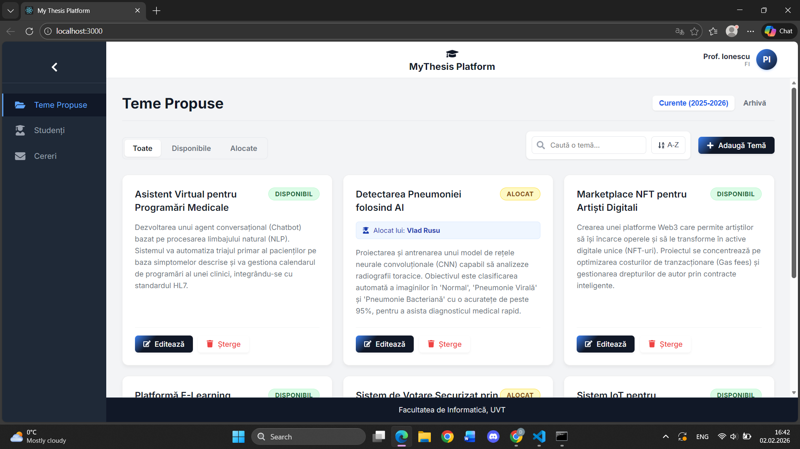
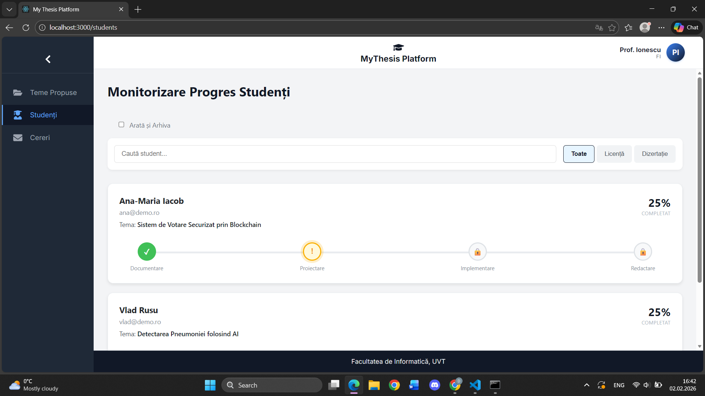
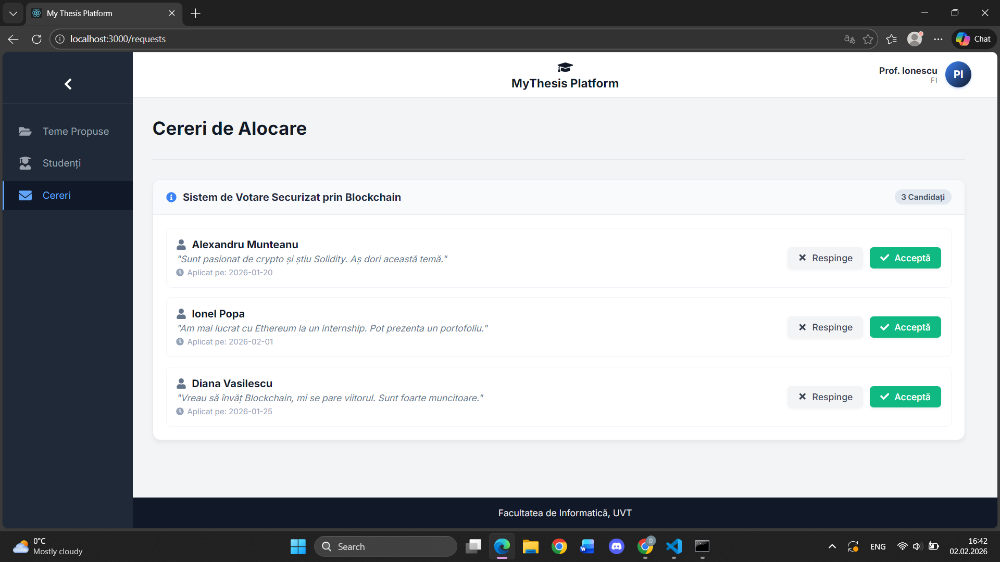

# MyThesis Platform - Academic Management System

-yellow)

**MyThesis Platform** este un sistem de asistență digitală destinat gestionării fluxului de lucrări de licență și disertație.
Proiectul rezolvă probleme administrative critice precum lipsa de vizibilitate asupra progresului studenților și dificultatea gestionării istoricului temelor (arhivare vs. oferte active).

---

## Funcționalități Cheie

* **Management Ciclu de Viață:** Gestionarea completă a temelor, de la stadiul de *Propunere (Disponibilă)* la *Alocată* și în final *Arhivată (Finalizată)*.
* **Arhivare Inteligentă (Read-Only):** Separarea logică a ofertei curente de istoricul anilor anteriori. Temele finalizate devin automat inactive (`pointer-events: none`) și vizuale distinct (`opacity`), prevenind modificările accidentale.
* **Monitorizare Progres:** Sistem granular de urmărire a etapelor (faze) pentru fiecare student, permițând profesorului să aprobe sau să solicite revizuiri pentru documente.
* **Filtrare Hibridă:** Motor de căutare complex care combină filtrarea după *Status* (Active/Finalizate), *Text* (Titlu/Descriere) și *ID Student*, asigurând o navigare rapidă prin baza de date.
* **Dashboard Statistici:** Calcularea și vizualizarea în timp real a metricilor cheie: numărul de studenți activi vs. absolvenți și media notelor pe promoții.

---

## Interfață & Flux de Lucru

Platforma oferă o experiență de utilizare fluidă, cu o delimitare clară între datele operaționale și cele istorice.

| Dashboard Profesor | Management Teme (Tab-uri) | Monitorizare Studenți |
| :---: | :---: | :---: |
|  |  |  |

---

## Stack Tehnic

* **Limbaj:** JavaScript (ES6+)
* **Frontend:**
    * `React.js`: Arhitectură bazată pe componente funcționale și Hooks (`useState`, `useEffect`).
    * `React Router`: Navigare tip SPA (Single Page Application).
    * `CSS Modules`: Stilizare izolată pentru prevenirea conflictelor vizuale.
* **Backend (Mock):**
    * `JSON Server`: API RESTful complet pentru persistența datelor (`students`, `theses`, `requests`).
* **Algoritmi:** Logică custom pentru maparea studenților pe teme (ID Matching) și filtrarea dinamică a listelor.

---

## Cum funcționează

1.  **Inițializare & Sincronizare:** La încărcare, aplicația execută cereri paralele (`Promise.all`) către endpoint-urile `/theses` și `/students` pentru a construi starea completă a aplicației.
2.  **Logica de Arhivare:** Sistemul detectează automat statusul temei (`completed`). Dacă aceasta este finalizată, este randată exclusiv în Tab-ul "Arhivă", unde interacțiunea este blocată programatic.
3.  **Mapare Semantică:** ID-urile numerice din baza de date sunt traduse în timp real în informații lisibile pentru utilizator (ex: `studentID: 101` devine "Alexandru Munteanu" pe cardul temei).
4.  **Procesare Progres:** Fiecare etapă a studentului (ex: "Plan Cercetare") este validată prin existența unui fișier atașat înainte de a permite schimbarea statusului în "Approved".
